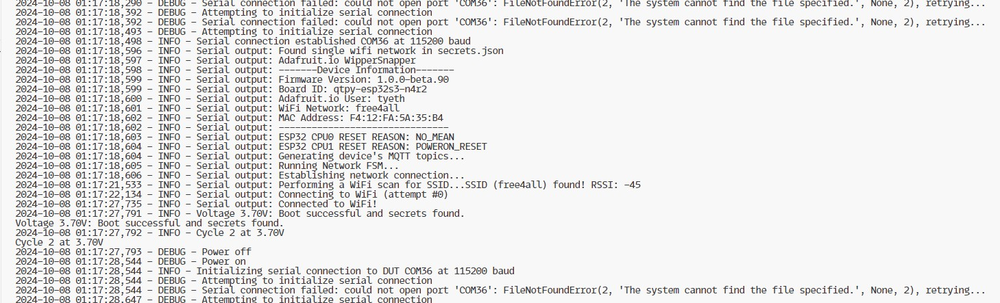

# Voltage Cycle Test with PPK2 and ESP32-S3

## Overview
This project automates the power cycling of an ESP32-S3 device using the Nordic Power Profiler Kit 2 (PPK2) to evaluate its performance under varying voltage conditions. 

The project includes scripts to control the PPK2 and monitor the ESP32-S3 over serial communication to verify successful boot and operational stability. 

The current code is expecting the [Adafruit WipperSnapper firmware](https://github.com/adafruit/adafruit_Wippersnapper_arduino/) to be running on the Device Under Test (DUT), and was written to test the loss/corruption of secrets.json in a fatfs partition when running on battery power after random number of reboots.

## Requirements

### Hardware
- **Nordic PPK2**: Used as a programmable power supply and for measuring power consumption.
- **ESP32-S3 Board**: Device under test.
- **Computer**: To run the python script(s) and control the PPK2 and serial communication.
- **USB Interruptor**: To manage isolating the power between USB VBUS and the Device Under Test while still allowing USB Communications with PC.

### Software
- **Python 3.8+**: Required to run the scripts (assume 3.12 or something more modern).
- **IRNAS PPK2 API Library**: [ppk2-api-python](https://github.com/IRNAS/ppk2-api-python) 
  - While available with `pip install ppk2-api`, there may be things worth picking up in the PRs by using from git:
  - Clone and install using the following commands:
    ```bash
    git clone https://github.com/IRNAS/ppk2-api-python.git
    cd ppk2-api-python
    echo 'checkout a PR branch now or in the future and it will be available immediately'
    pip install -e .
    ```
- **PySerial**: For communication with the ESP32-S3. (Probably already available)
  ```bash
  pip install pyserial
  ```
- **Logging Module**: Configured to record test logs in a `voltage_test.log` file.

## Setup

[Fritzing diagram: ](brownout.fzz)


0. Disconnect all usb cables + depower all devices.
1. **Connect Hardware**:
   - Connect the **ESP32-S3** to the PPK2, I'm using the Battery input on an Adafruit QTPY ESP32S3 (n4r2) with Lipo BFF, using the battery input pins for the PPK2 connection.
     - Alternatively use an appropriate connection method to power the board. e.g. A Metro board (debuggable) with StemmaQT MAX17048 taking the ppk2 supply as battery and then a two female jst-ph plugged cable (or jumper cables) from the MAX17048 second port to the Metro power in (battery jst).
   - Use a **USB Switchable Breakout a.k.a. "Isolator"** [I used this one](https://www.adafruit.com/product/5972) to disconnect the USB VBUS from the computer and the ESP32s3/DUT.
   - Ensure **ground connections** between all components (should be now).
   - If using logic pins of PPK2 then include a vRef and ground connection to the 3v3 + Gnd from QTPY to the PPK2 logic pins labelled VCC + GND

2. **Configure COM Ports**:
   - Edit the Python scripts to set the correct COM ports for both the PPK2 and ESP32-S3 connections.
   - Replace `PPK2_COM_PORT` and `SERIAL_PORT` with your specific port numbers (e.g., `COM34` for PPK2 and `COM36` for ESP32-S3).

## Scripts
- **Main Voltage Cycle Test Script**: This script powers on the DUT, runs through multiple voltage levels, and checks if the ESP32-S3 boots and connects to WiFi successfully.
  - The voltage starts at `3.0V` and decrements down to `2.8V` with steps of `0.01V`. The ESP32-S3 is tested for each voltage level.
  - Logs are saved in a file named `voltage_test.log`.
  - The power cycle test is repeated `50` times per voltage level.
  - Adjust the numbers to suite your needs, along with the conditionals for success+failure serial messages.
  
- **Power Toggle Test Script**: This script tests if the power from PPK2 is toggled on/off as expected. It cycles between `800mV`, `1500mV`, and `3000mV` every `3 seconds`, turning the device off for `2 seconds` between cycles.

## Usage
1. **Voltage Cycle Test Script**
   - This script is used to evaluate the ESP32-S3 boot reliability under varying voltages.
   - Run the script using:
     ```bash
     python voltage_cycle_test.py
     ```
   - Logs and measurement data will be saved to CSV files for each cycle.

2. **Power Toggle Test Script**
   - The script helps verify if the power from the PPK2 is reliably toggling between the defined voltage levels.
   - Run the script using:
     ```bash
     python power_toggle_test.py
     ```

## Example output (logging level changed to DEBUG):


## Notes
- Ensure that the **ESP32-S3** has time to settle after each power cycle.
- Logs and power measurements are saved to help analyze device behavior.
- The script retries connection to the ESP32-S3 serial port until it is successful, ensuring stable communication after power cycling.

## License
This project uses the licenses of the respective dependencies and no others.

## Acknowledgements
- [IRNAS](https://github.com/IRNAS) for providing the **PPK2 Python API** to automate power monitoring and logging.
- [Adafruit](https://www.adafruit.com) for providing me with gainful employment and the hardware to play with such things.
